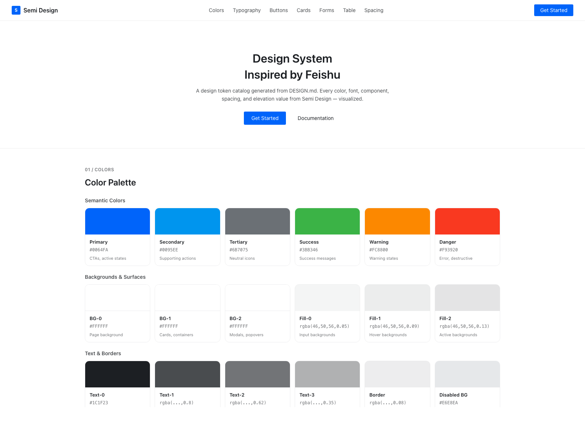
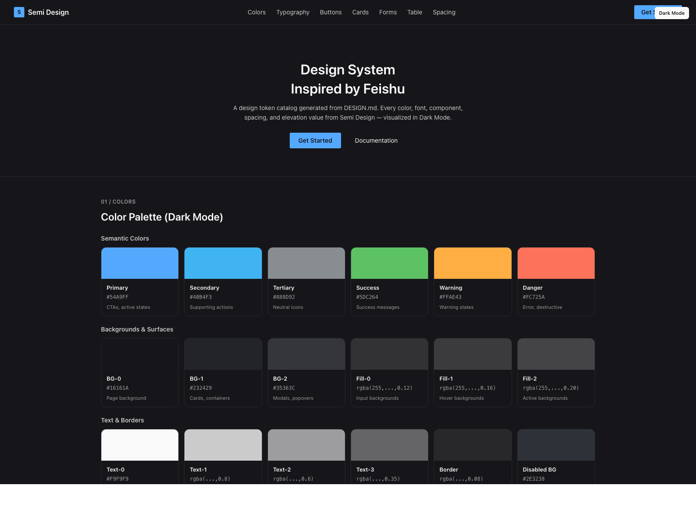

# Lark / Universe Design 风格设计系统参考

这是一个面向 AI 生成界面的设计系统参考仓库，目标是提供一份接近 Lark / Universe Design 视觉语言的 `DESIGN.md`，方便在 Cursor、Claude、Codex、Stitch 等工具中直接复用。

默认文档语言为中文，便于中文场景下直接引用、复制和二次改写。

## 仓库内容

| 文件 | 说明 |
|------|------|
| `DESIGN.md` | 设计系统主文档，包含颜色、字体、间距、组件和界面风格约束 |
| `README.md` | 当前说明文档 |
| `preview.html` | 亮色预览页 |
| `preview-dark.html` | 暗色预览页 |
| `assets/preview-light.png` | 亮色预览截图 |
| `assets/preview-dark.png` | 暗色预览截图 |

## 使用方式

将 `DESIGN.md` 放到你的项目根目录，或者把其中内容直接作为提示词上下文交给 AI。

```txt
请基于 DESIGN.md 生成一个具有 Lark / Universe Design 风格的企业后台页面。
要求遵循其中的颜色、字体、圆角、表单和卡片规范。
```

## 设计特点

- 以 Design Token 为核心，便于在 Light / Dark 模式之间切换
- 适合中英文混排的企业级界面风格
- 表单、卡片、表格等后台高频组件风格明确
- 强调清晰的信息层级、克制的圆角和高可读性
- 适合作为 AI 生成 Lark / Universe Design 风格页面时的统一参考

## 参考来源

- 模式参考：`DESIGN.md` 的组织方式参考了 [VoltAgent/awesome-design-md](https://github.com/VoltAgent/awesome-design-md)
- 样式参考：整体视觉语言主要参考 [Semi Design 中文站](https://semi.design/zh-CN)

## 在线预览

- 亮色预览：[https://magic.solutionsuite.cn/html-box/vfZCKoXveaB](https://magic.solutionsuite.cn/html-box/vfZCKoXveaB)
- 暗色预览：[https://magic.solutionsuite.cn/html-box/vfZCOjCfqkQ](https://magic.solutionsuite.cn/html-box/vfZCOjCfqkQ)

## 截图

### 亮色预览

[](https://magic.solutionsuite.cn/html-box/vfZCKoXveaB)

### 暗色预览

[](https://magic.solutionsuite.cn/html-box/vfZCOjCfqkQ)

## 说明

这是一个社区整理的设计系统参考仓库，不是 Semi Design 官方文档。仓库中的样式信息基于公开可见的设计语言、设计 token 和预览页面整理而成，仅用于设计参考与 AI 生成辅助。
